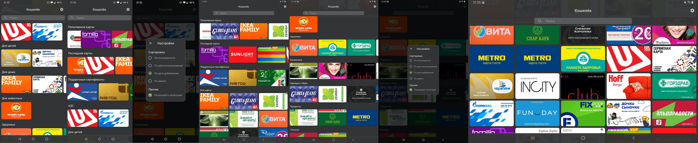
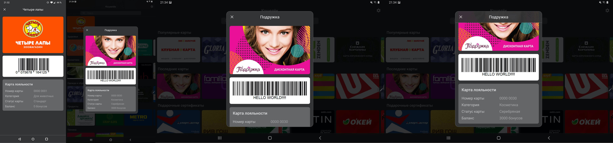

# Кошелёк
Приложение для конкурса [Кошелёк Mobile Challenge](https://cardsmobile.ru/kmc).
Скачать приложение можно [тут](https://github.com/g000sha256/wallet/blob/master/Wallet.apk).

Реализовано: быстрая загрузка и открытие экранов, оффлайн-режим, группировки карточек, анимации, плавный и красивый UI, улучшен поиск.
В официальном приложении вертикальная карусель карт неудобна для поиска, так как на экране видно 2,5 карты.
Такой режим точно нужно сделать второстепенным, чтобы у юзеров, например,  осталась возможность играться с картами.
В новом приложении похожий эффект сделан в горизонтальных каруселях, но там он никак не мешает искать карты.

### Общее
- Оффлайн-режим.
При первом запуске загружаются и кешируются карты и сразу все картинки (с кодами тоже), чтобы к ним был доступ без интернета.
При последующих запусках все данные отображаются сразу и происходит их обновление в фоне.
- Поддержка Android 21+.
Официальное приложение в Google Play имеет именно эту минимальную версию, поэтому меньше делать нет смысла.
- Расширение границ экрана за счёт полупрозрачных элементов. Под ними видно скролящийся контент.
- Поддержка планшетов. Видно больше карточек и есть поворот экрана.
- Малый размер приложения (714Кб).

### Экран карт
- Карты всегда отображаются плиткой, чтобы их больше помещалось на экране.
- Выбор сортировки по популярности, по дате использования, по дате добавления и по имени.
- Можно включить/отключить группировку по категориям.
- Карусель популярных карт. Не показывается, если включена сортировка по популярности.
- Карусель последних используемых карт. Не показывается, если включена сортировка по дате использования.
- Популярность и дата использования определяются локально по открытию карты. Это можно присылать с бекенда.
- Отдельная карусель для сертификатов, чтобы пользователь скорее их потратил. К ним тоже применяется сортировка из настроек.
- Карусели сделаны с похожим из официального приложения эффектом - когда карты наслаиваются друг на друга.
- Поиск более заметный и имеет большую зону клика. Выполняется на этом же экране.
Ищет по имени, категории и дополнительному массиву названий. Работает оффлайн.
- Когда показывается клавиатура, тулбар скрывается, оставляя только поиск. Таким образом видно больше карточек.
- Из-за небольших карточек видно больше результатов поиска (примерно 6-8, вместо 2), благодаря чему можно найти нужную карту с 1-2 букв.
- При клике на шапку происходит скролл к началу списка.

### Экран просмотра карты
- На экране ничего не грузится и не блокирует отображение. Все картинки уже прогружены заранее.
- Отображается лицевая сторона карты, код, номер, категория, дата действия, статус и баланс.
При клике на карту показывается обратная сторона карты.
- Крупный штрих-код.
- Повышается яркость экрана.
- На планшетах показывается в виде диалога.

## Проблемы официального приложения (на примере One Plus 6T)
- От клика по иконке в лоунчере до показа карт проходит почти 4 секунды (с кешом).
В новом приложении - половина секунды с кешом и секунда без кеша.
Скорость показа очень важна, когда человек уже стоит на кассе.
- Не сохраняется выбранный вид отображения карт на главной при переходе в экран уведомлений или перезапуске приложения.
- На главной видно 2,5 карты. В новом приложении 10-12.
Другие виды отображения не учитываются, так как не все о них знают и см. предыдущий пункт.
- В поиске видно только 2 карты. В новом приложении 6-8.
- `Вы уверены, что хотите удалить карту?` и кнопка `Продолжить`. Нет ответов на вопрос.
- Если скролить список карт с любого края быстро туда-сюда в небольшое касание - будут показываться кривые кадры.
Не очень хороший кейс, если юзеры любят крутить карусель.
- Видно, как самые нижние карты в карусели резко исчезают, хотя кусок карты ещё виден.